# Awesome Deep Neural Network Optimization [](https://awesome.re)

<p align="center">
  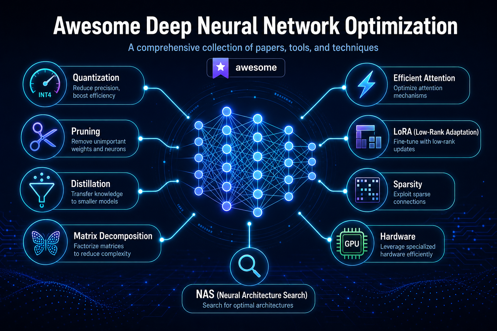
</p>

A curated, comprehensive list of papers, tools, and codebases covering **all major optimization techniques** for deep neural networks — from training to inference, from cloud to edge. We continuously improve this project. PRs for missing works are welcome.

---

## Table of Contents

- [1. Quantization](#1-quantization)
  - [1.1 Survey Papers](#11-survey-papers)
  - [1.2 Post-Training Quantization (PTQ)](#12-post-training-quantization-ptq)
  - [1.3 Quantization-Aware Training (QAT)](#13-quantization-aware-training-qat)
  - [1.4 Binary / Ternary Networks](#14-binary--ternary-networks)
  - [1.5 Mixed-Precision Quantization](#15-mixed-precision-quantization)
  - [1.6 LLM Quantization](#16-llm-quantization)
  - [1.7 Diffusion Model Quantization](#17-diffusion-model-quantization)
  - [1.8 KV Cache Quantization](#18-kv-cache-quantization)
- [2. Matrix Decomposition & Fast Transforms](#2-matrix-decomposition--fast-transforms)
  - [2.1 Fast Hadamard Transform](#21-fast-hadamard-transform)
  - [2.2 Low-Rank Factorization](#22-low-rank-factorization)
  - [2.3 Tensor Decomposition](#23-tensor-decomposition)
  - [2.4 Structured Matrices (Monarch, Butterfly, Toeplitz)](#24-structured-matrices-monarch-butterfly-toeplitz)
  - [2.5 SVD-Based Compression](#25-svd-based-compression)
- [3. Pruning & Sparsity](#3-pruning--sparsity)
  - [3.1 Survey Papers](#31-survey-papers)
  - [3.2 Unstructured Pruning](#32-unstructured-pruning)
  - [3.3 Structured Pruning](#33-structured-pruning)
  - [3.4 Dynamic / Runtime Pruning](#34-dynamic--runtime-pruning)
  - [3.5 LLM Pruning](#35-llm-pruning)
  - [3.6 Lottery Ticket Hypothesis](#36-lottery-ticket-hypothesis)
- [4. Knowledge Distillation](#4-knowledge-distillation)
  - [4.1 Survey Papers](#41-survey-papers)
  - [4.2 Response-Based Distillation](#42-response-based-distillation)
  - [4.3 Feature-Based Distillation](#43-feature-based-distillation)
  - [4.4 Self-Distillation](#44-self-distillation)
  - [4.5 LLM Distillation](#45-llm-distillation)
  - [4.6 Data-Free Distillation](#46-data-free-distillation)
- [5. Efficient Architectures](#5-efficient-architectures)
  - [5.1 Efficient Transformers & Attention](#51-efficient-transformers--attention)
  - [5.2 Linear Attention & State Space Models](#52-linear-attention--state-space-models)
  - [5.3 Mixture of Experts (MoE)](#53-mixture-of-experts-moe)
  - [5.4 Lightweight CNNs](#54-lightweight-cnns)
- [6. Neural Architecture Search (NAS)](#6-neural-architecture-search-nas)
  - [6.1 Survey Papers](#61-survey-papers)
  - [6.2 Efficient NAS](#62-efficient-nas)
  - [6.3 Hardware-Aware NAS](#63-hardware-aware-nas)
- [7. Training Optimization](#7-training-optimization)
  - [7.1 Optimizers](#71-optimizers)
  - [7.2 Mixed-Precision Training](#72-mixed-precision-training)
  - [7.3 Gradient Compression & Communication](#73-gradient-compression--communication)
  - [7.4 Large-Scale Distributed Training](#74-large-scale-distributed-training)
  - [7.5 Memory-Efficient Training](#75-memory-efficient-training)
- [8. Inference Optimization](#8-inference-optimization)
  - [8.1 Operator Fusion & Kernel Optimization](#81-operator-fusion--kernel-optimization)
  - [8.2 Speculative Decoding](#82-speculative-decoding)
  - [8.3 KV Cache Optimization](#83-kv-cache-optimization)
  - [8.4 Batching & Scheduling](#84-batching--scheduling)
  - [8.5 Compilation & Graph Optimization](#85-compilation--graph-optimization)
- [9. Efficient Fine-Tuning (PEFT)](#9-efficient-fine-tuning-peft)
  - [9.1 LoRA & Variants](#91-lora--variants)
  - [9.2 Prompt Tuning & Adapters](#92-prompt-tuning--adapters)
- [10. Token & Sequence Optimization](#10-token--sequence-optimization)
  - [10.1 Token Pruning & Merging](#101-token-pruning--merging)
  - [10.2 Early Exit / Dynamic Inference](#102-early-exit--dynamic-inference)
  - [10.3 Context Compression](#103-context-compression)
- [11. Hardware-Specific Optimization](#11-hardware-specific-optimization)
  - [11.1 GPU Kernel Engineering](#111-gpu-kernel-engineering)
  - [11.2 Edge & Mobile Deployment](#112-edge--mobile-deployment)
  - [11.3 FPGA & ASIC Accelerators](#113-fpga--asic-accelerators)
- [12. Activation & Normalization Optimization](#12-activation--normalization-optimization)
- [13. Data Efficiency & Augmentation](#13-data-efficiency--augmentation)
- [Related Awesome Lists](#related-awesome-lists)
- [Frameworks & Tools](#frameworks--tools)

---

## 1. Quantization

<p align="center">
  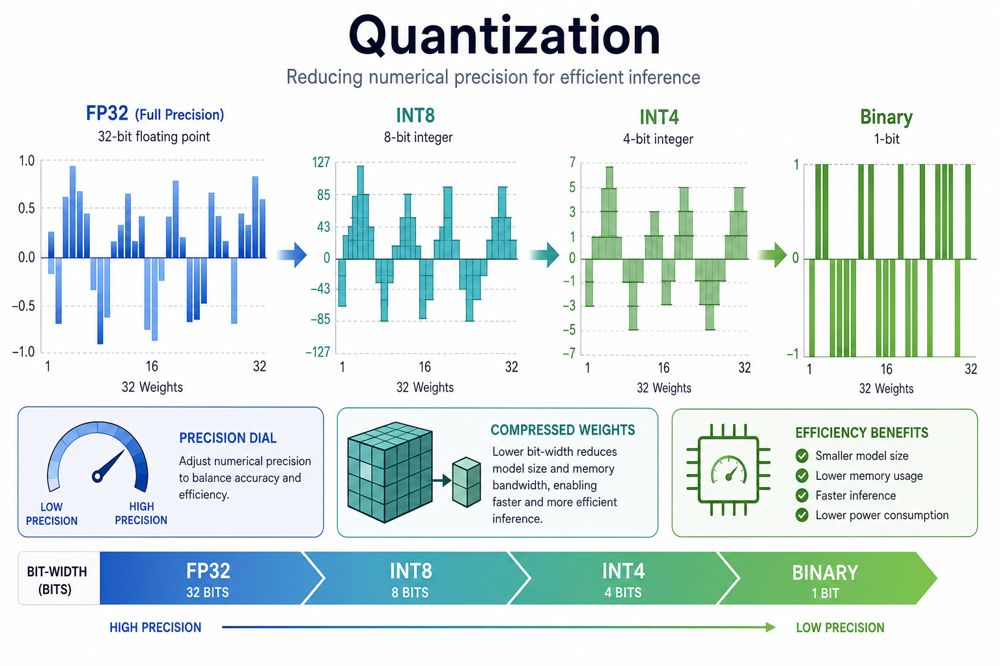
</p>

> Reducing numerical precision of weights, activations, and/or gradients to compress models and accelerate inference.

### 1.1 Survey Papers

| Year | Venue | Title | Links |
|------|-------|-------|-------|
| 2025 | Neural Networks | A Survey of Low-bit Large Language Models: Basics, Systems, and Algorithms | [[Paper](https://arxiv.org/abs/2402.09714)] |
| 2025 | arXiv | Low-bit Model Quantization for Deep Neural Networks: A Survey | [[Paper](https://arxiv.org/abs/2505.05530)] |
| 2021 | arXiv | A Survey of Quantization Methods for Efficient Neural Network Inference | [[Paper](https://arxiv.org/abs/2103.13630)] |
| 2020 | Pattern Recognition | Binary Neural Networks: A Survey | [[Paper](https://arxiv.org/abs/2004.03333)] |

### 1.2 Post-Training Quantization (PTQ)

| Year | Venue | Title | Links |
|------|-------|-------|-------|
| 2026 | ICLR | Qronos: Correcting the Past by Shaping the Future in Post-Training Quantization | [[Paper](https://openreview.net/forum?id=qronos)] |
| 2026 | ICLR | LogART: Pushing the Limit of Efficient Logarithmic Post-Training Quantization | [[Paper](https://openreview.net/forum?id=logart)] [[Code](https://github.com/)] |
| 2025 | ICML | FlatQuant: Flatness Matters for LLM Quantization | [[Paper](https://arxiv.org/abs/2404.00459)] [[Code](https://github.com/ruikangliu/FlatQuant)] |
| 2025 | NeurIPS | DartQuant: Efficient Rotational Distribution Calibration for LLM Quantization | [[Paper](https://arxiv.org/abs/2407.11987)] [[Code](https://github.com/)] |
| 2024 | NeurIPS | PTQ4DiT: Post-training Quantization for Diffusion Transformers | [[Paper](https://arxiv.org/abs/2405.16005)] |
| 2024 | ICML | QuIP#: Even Better LLM Quantization with Hadamard Incoherence and Lattice Codebooks | [[Paper](https://arxiv.org/abs/2402.04396)] [[Code](https://github.com/Cornell-RelaxML/quip-sharp)] |
| 2024 | ICML | SqueezeLLM: Dense-and-Sparse Quantization | [[Paper](https://arxiv.org/abs/2306.07629)] [[Code](https://github.com/SqueezeAILab/SqueezeLLM)] |
| 2024 | MLSys | AWQ: Activation-aware Weight Quantization for On-Device LLM Compression and Acceleration | [[Paper](https://arxiv.org/abs/2306.00978)] [[Code](https://github.com/mit-han-lab/llm-awq)] |
| 2023 | ICLR | GPTQ: Accurate Post-Training Quantization for Generative Pre-trained Transformers | [[Paper](https://arxiv.org/abs/2210.17323)] [[Code](https://github.com/IST-DASLab/gptq)] |
| 2023 | ICML | SmoothQuant: Accurate and Efficient Post-Training Quantization for Large Language Models | [[Paper](https://arxiv.org/abs/2211.10438)] [[Code](https://github.com/mit-han-lab/smoothquant)] |
| 2022 | NeurIPS | Optimal Brain Compression: A Framework for Accurate Post-Training Quantization and Pruning | [[Paper](https://arxiv.org/abs/2208.11580)] [[Code](https://github.com/IST-DASLab/OBC)] |
| 2021 | ICLR | BRECQ: Pushing the Limit of Post-Training Quantization by Block Reconstruction | [[Paper](https://arxiv.org/abs/2102.05426)] [[Code](https://github.com/yhhhli/BRECQ)] |

### 1.3 Quantization-Aware Training (QAT)

| Year | Venue | Title | Links |
|------|-------|-------|-------|
| 2026 | ICLR | Towards Quantization-Aware Training for Ultra-Low-Bit Reasoning LLMs | [[Paper](https://openreview.net/forum?id=qat-reasoning)] |
| 2025 | ACL | EfficientQAT: Efficient Quantization-Aware Training for Large Language Models | [[Paper](https://arxiv.org/abs/2407.11062)] [[Code](https://github.com/OpenGVLab/EfficientQAT)] |
| 2024 | ICLR | OmniQuant: Omnidirectionally Calibrated Quantization for Large Language Models | [[Paper](https://arxiv.org/abs/2308.13137)] [[Code](https://github.com/OpenGVLab/OmniQuant)] |
| 2020 | ICLR | Learned Step Size Quantization | [[Paper](https://arxiv.org/abs/1902.08153)] |
| 2018 | ICLR | PACT: Parameterized Clipping Activation for Quantized Neural Networks | [[Paper](https://arxiv.org/abs/1805.06085)] |

### 1.4 Binary / Ternary Networks

| Year | Venue | Title | Links |
|------|-------|-------|-------|
| 2026 | ICLR | PT²-LLM: Post-Training Ternarization for Large Language Models | [[Paper](https://openreview.net/forum?id=pt2llm)] [[Code](https://github.com/)] |
| 2026 | ICLR | Tequila: Deadzone-free Ternary Quantization for Large Language Models | [[Paper](https://openreview.net/forum?id=tequila)] |
| 2024 | ICML | BiLLM: Pushing the Limit of Post-Training Quantization for LLMs | [[Paper](https://arxiv.org/abs/2402.04291)] [[Code](https://github.com/Aaronhuang-778/BiLLM)] |
| 2020 | ECCV | ReActNet: Towards Precise Binary Neural Network with Generalized Activation Functions | [[Paper](https://arxiv.org/abs/2003.03488)] [[Code](https://github.com/liuzechun/ReActNet)] |
| 2016 | NeurIPS | Binarized Neural Networks | [[Paper](https://arxiv.org/abs/1602.02830)] |
| 2016 | ECCV | XNOR-Net: ImageNet Classification Using Binary Convolutional Neural Networks | [[Paper](https://arxiv.org/abs/1603.05279)] [[Code](https://github.com/allenai/XNOR-Net)] |

### 1.5 Mixed-Precision Quantization

| Year | Venue | Title | Links |
|------|-------|-------|-------|
| 2026 | ICLR | Channel-Aware Mixed-Precision Quantization for Efficient Long-Context Inference | [[Paper](https://openreview.net/forum?id=camp)] |
| 2026 | ICLR | MicroMix: Efficient Mixed-Precision Quantization with Microscaling Formats for LLMs | [[Paper](https://openreview.net/forum?id=micromix)] [[Code](https://github.com/)] |
| 2026 | arXiv | EdgeRazor: A Lightweight Framework for LLMs via Mixed-Precision QAT Distillation | [[Paper](https://arxiv.org/abs/2606.00000)] |
| 2025 | ICML | SliM-LLM: Salience-Driven Mixed-Precision Quantization for Large Language Models | [[Paper](https://arxiv.org/abs/2405.14917)] [[Code](https://github.com/)] |
| 2019 | CVPR | HAQ: Hardware-Aware Automated Quantization with Mixed Precision | [[Paper](https://arxiv.org/abs/1811.08886)] [[Code](https://github.com/mit-han-lab/haq)] |

### 1.6 LLM Quantization

| Year | Venue | Title | Links |
|------|-------|-------|-------|
| 2026 | ICLR | ParoQuant: Pairwise Rotation Quantization for Efficient Reasoning LLM Inference | [[Paper](https://openreview.net/forum?id=paroquant)] [[Code](https://github.com/)] |
| 2026 | ICLR | QWHA: Quantization-Aware Walsh-Hadamard Adaptation for PEFT on LLMs | [[Paper](https://openreview.net/forum?id=qwha)] [[Code](https://github.com/)] |
| 2025 | ICLR | SpinQuant: LLM Quantization with Learned Rotations | [[Paper](https://arxiv.org/abs/2405.16406)] |
| 2025 | ICLR | OSTQuant: Refining LLM Quantization with Orthogonal and Scaling Transformations | [[Paper](https://arxiv.org/abs/2409.01592)] [[Code](https://github.com/)] |
| 2024 | arXiv | QuaRot: Outlier-Free 4-Bit Inference in Rotated LLMs | [[Paper](https://arxiv.org/abs/2404.00456)] [[Code](https://github.com/spcl/QuaRot)] |
| 2023 | NeurIPS | QLoRA: Efficient Finetuning of Quantized LLMs | [[Paper](https://arxiv.org/abs/2305.14314)] [[Code](https://github.com/artidoro/qlora)] |
| 2023 | NeurIPS | QuIP: 2-Bit Quantization of Large Language Models With Guarantees | [[Paper](https://arxiv.org/abs/2307.13304)] [[Code](https://github.com/Cornell-RelaxML/QuIP)] |
| 2022 | NeurIPS | LLM.int8(): 8-bit Matrix Multiplication for Transformers at Scale | [[Paper](https://arxiv.org/abs/2208.07339)] [[Code](https://github.com/TimDettmers/bitsandbytes)] |

### 1.7 Diffusion Model Quantization

| Year | Venue | Title | Links |
|------|-------|-------|-------|
| 2026 | ICLR | QVGen: Pushing the Limit of Quantized Video Generative Models | [[Paper](https://openreview.net/forum?id=qvgen)] |
| 2025 | ICLR | SVDQuant: Absorbing Outliers by Low-Rank Component for 4-Bit Diffusion Models | [[Paper](https://arxiv.org/abs/2411.05007)] |
| 2024 | NeurIPS | BiDM: Pushing the Limit of Quantization for Diffusion Models | [[Paper](https://arxiv.org/abs/2405.13983)] |
| 2023 | ICCV | Q-diffusion: Quantizing Diffusion Models | [[Paper](https://arxiv.org/abs/2302.04304)] [[Code](https://github.com/Xiuyu-Li/q-diffusion)] |
| 2023 | CVPR | Post-training Quantization on Diffusion Models | [[Paper](https://arxiv.org/abs/2211.15736)] [[Code](https://github.com/)] |

### 1.8 KV Cache Quantization

| Year | Venue | Title | Links |
|------|-------|-------|-------|
| 2026 | ICLR | PM-KVQ: Progressive Mixed-precision KV Cache Quantization for Long-CoT LLMs | [[Paper](https://openreview.net/forum?id=pmkvq)] [[Code](https://github.com/)] |
| 2024 | NeurIPS | KVQuant: Towards 10 Million Context Length LLM Inference with KV Cache Quantization | [[Paper](https://arxiv.org/abs/2401.18079)] |
| 2024 | NeurIPS | ZipCache: Accurate and Efficient KV Cache Quantization with Salient Token Identification | [[Paper](https://arxiv.org/abs/2405.14256)] |
| 2024 | ICML | KIVI: A Tuning-Free Asymmetric 2bit Quantization for KV Cache | [[Paper](https://arxiv.org/abs/2402.02750)] [[Code](https://github.com/jy-yuan/KIVI)] |

**[→ For the full quantization paper list, see [Awesome-Model-Quantization](https://github.com/Efficient-ML/Awesome-Model-Quantization)]**

---

## 2. Matrix Decomposition & Fast Transforms

<p align="center">
  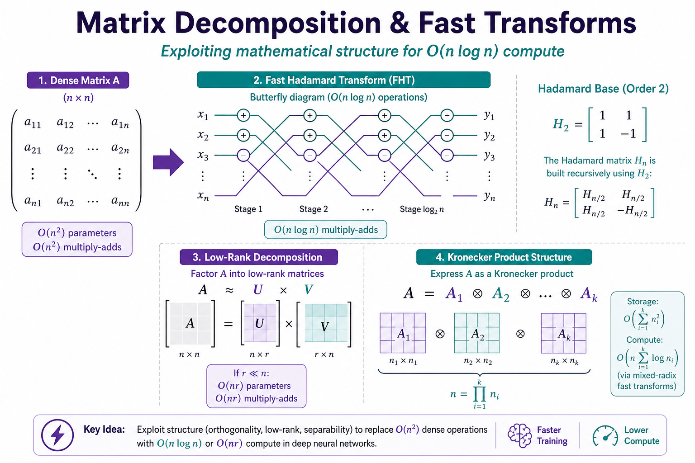
</p>

> Exploiting mathematical structure in weight matrices and operators to reduce compute and memory costs.

### 2.1 Fast Hadamard Transform

The [Fast Hadamard Transform (FHT)](https://en.wikipedia.org/wiki/Hadamard_transform) replaces O(n²) matrix-vector products with O(n log n) butterfly operations using ±1 structured matrices — the "FFT for ±1 matrices."

**Benchmark Implementation:**
- [**Fast-Hadamard-Transform**](https://github.com/Gaurav14cs17/Fast-Hadamard-Transform) — A comprehensive benchmark comparing naive O(n²) vs fast O(n log n) butterfly decomposition, with timing data, memory analysis, and 6 real-world use-case demos (random projection, quantization rotation, feature decorrelation, neural net layers, signal compression, error-correcting codes).

| Year | Venue | Title | Links |
|------|-------|-------|-------|
| 2026 | ICLR | QWHA: Quantization-Aware Walsh-Hadamard Adaptation for PEFT on LLMs | [[Paper](https://openreview.net/forum?id=qwha)] [[Code](https://github.com/)] |
| 2025 | ICLR | SpinQuant: LLM Quantization with Learned Rotations | [[Paper](https://arxiv.org/abs/2405.16406)] |
| 2024 | ICML | QuIP#: Even Better LLM Quantization with Hadamard Incoherence and Lattice Codebooks | [[Paper](https://arxiv.org/abs/2402.04396)] [[Code](https://github.com/Cornell-RelaxML/quip-sharp)] |
| 2024 | arXiv | QuaRot: Outlier-Free 4-Bit Inference in Rotated LLMs | [[Paper](https://arxiv.org/abs/2404.00456)] [[Code](https://github.com/spcl/QuaRot)] |
| 2023 | NeurIPS | QuIP: 2-Bit Quantization of Large Language Models With Guarantees | [[Paper](https://arxiv.org/abs/2307.13304)] [[Code](https://github.com/Cornell-RelaxML/QuIP)] |
| 2024 | arXiv | HadaCore: Tensor Core Accelerated Hadamard Transform Kernel | [[Paper](https://arxiv.org/abs/2405.13012)] |
| 2024 | GitHub | fast-hadamard-transform (Tri Dao CUDA kernel) | [[Code](https://github.com/Dao-AILab/fast-hadamard-transform)] |
| 2023 | NeurIPS | FNet: Mixing Tokens with Fourier Transforms (related Hadamard mixing) | [[Paper](https://arxiv.org/abs/2105.03824)] |
| 2006 | FOCS | The Fast Johnson-Lindenstrauss Transform (SRHT) | [[Paper](https://www.cs.princeton.edu/~chazelle/pubs/FJLT-sicomp09.pdf)] |

**Key applications of Hadamard in DNN optimization:**
- **Quantization rotation** — QuIP#, QuaRot, SpinQuant use Hadamard to spread outliers before quantization, reducing quantization error by 5–14x
- **Random projection (SRHT)** — O(n log n) dimensionality reduction vs O(n²) for dense Gaussian
- **Feature mixing** — Replace O(n³) PCA or O(n²) random rotation with O(n log n) deterministic mixing
- **Parameter-free neural layers** — Hadamard "sandwich" layers (H·D·H·D) with 2n params vs n² for dense
- **Error-correcting codes** — Maximum-distance codewords for communication
- **Signal compression** — Walsh-Hadamard spectrum ideal for binary/digital signals

### 2.2 Low-Rank Factorization

| Year | Venue | Title | Links |
|------|-------|-------|-------|
| 2025 | ICLR | SVDQuant: Absorbing Outliers by Low-Rank Component for 4-Bit Diffusion Models | [[Paper](https://arxiv.org/abs/2411.05007)] |
| 2024 | ICML | LQER: Low-Rank Quantization Error Reconstruction for LLMs | [[Paper](https://arxiv.org/abs/2402.02446)] |
| 2024 | ICML | BiE: Bi-Exponent Block Floating-Point for Large Language Models Quantization | [[Paper](https://arxiv.org/abs/2406.02657)] |
| 2023 | arXiv | LoSparse: Structured Compression of Large Language Models based on Low-Rank and Sparse Approximation | [[Paper](https://arxiv.org/abs/2306.11222)] |
| 2022 | arXiv | Monarch: Expressive Structured Matrices for Efficient and Accurate Training | [[Paper](https://arxiv.org/abs/2204.00595)] [[Code](https://github.com/HazyResearch/monarch)] |
| 2020 | NeurIPS | Compressing BERT: Studying the Effects of Weight Pruning on Transfer Learning | [[Paper](https://arxiv.org/abs/2002.11985)] |
| 2014 | NeurIPS | Exploiting Linear Structure Within Convolutional Networks for Efficient Evaluation | [[Paper](https://arxiv.org/abs/1404.0736)] |

### 2.3 Tensor Decomposition

| Year | Venue | Title | Links |
|------|-------|-------|-------|
| 2023 | arXiv | TensorGPT: Efficient Compression of the Embedding Layer in LLMs based on the Tensor-Train Decomposition | [[Paper](https://arxiv.org/abs/2307.00526)] |
| 2020 | arXiv | Tensor Decompositions for Temporal Knowledge Base Completion | [[Paper](https://arxiv.org/abs/2004.04926)] |
| 2019 | ICLR | Efficient Neural Network Compression via Tensor Decomposition | [[Paper](https://arxiv.org/abs/1812.09868)] |
| 2016 | ICLR | Compression of Deep Convolutional Neural Networks for Fast and Low Power Mobile Applications (Tucker decomposition) | [[Paper](https://arxiv.org/abs/1511.06530)] |
| 2015 | ICML | Tensorizing Neural Networks | [[Paper](https://arxiv.org/abs/1509.06569)] [[Code](https://github.com/Bihaqo/TensorNet)] |
| 2014 | arXiv | Speeding up Convolutional Neural Networks with Low Rank Expansions (CP decomposition) | [[Paper](https://arxiv.org/abs/1405.3866)] |

### 2.4 Structured Matrices (Monarch, Butterfly, Toeplitz)

| Year | Venue | Title | Links |
|------|-------|-------|-------|
| 2024 | ICML | Spectral State Space Models | [[Paper](https://arxiv.org/abs/2312.06837)] |
| 2023 | NeurIPS | Monarch Mixer: A Simple Sub-Quadratic GEMM-Based Architecture | [[Paper](https://arxiv.org/abs/2310.12109)] [[Code](https://github.com/HazyResearch/m2)] |
| 2022 | ICML | Monarch: Expressive Structured Matrices for Efficient and Accurate Training | [[Paper](https://arxiv.org/abs/2204.00595)] [[Code](https://github.com/HazyResearch/monarch)] |
| 2021 | NeurIPS | Pixelated Butterfly: Simple and Efficient Sparse Training for Neural Network Models | [[Paper](https://arxiv.org/abs/2112.00029)] [[Code](https://github.com/HazyResearch/pixelated-butterfly)] |
| 2020 | ICML | Kaleidoscope: An Efficient, Learnable Representation for All Structured Linear Maps | [[Paper](https://arxiv.org/abs/2012.14966)] [[Code](https://github.com/HazyResearch/learning-circuits)] |
| 2019 | NeurIPS | Learning Fast Algorithms for Linear Transforms Using Butterfly Factorizations | [[Paper](https://arxiv.org/abs/1903.05895)] [[Code](https://github.com/HazyResearch/learning-circuits)] |

### 2.5 SVD-Based Compression

| Year | Venue | Title | Links |
|------|-------|-------|-------|
| 2024 | arXiv | ASVD: Activation-aware Singular Value Decomposition for Compressing Large Language Models | [[Paper](https://arxiv.org/abs/2312.05821)] [[Code](https://github.com/hahnyuan/ASVD4LLM)] |
| 2023 | arXiv | SliceGPT: Compress Large Language Models by Deleting Rows and Columns | [[Paper](https://arxiv.org/abs/2401.15024)] [[Code](https://github.com/microsoft/TransformerCompression)] |
| 2023 | arXiv | LaCo: Large Language Model Pruning via Layer Collapse | [[Paper](https://arxiv.org/abs/2402.11187)] |
| 2017 | arXiv | Coordinating Filters for Faster Deep Neural Networks (SVD filter decomposition) | [[Paper](https://arxiv.org/abs/1703.09746)] |

---

## 3. Pruning & Sparsity

<p align="center">
  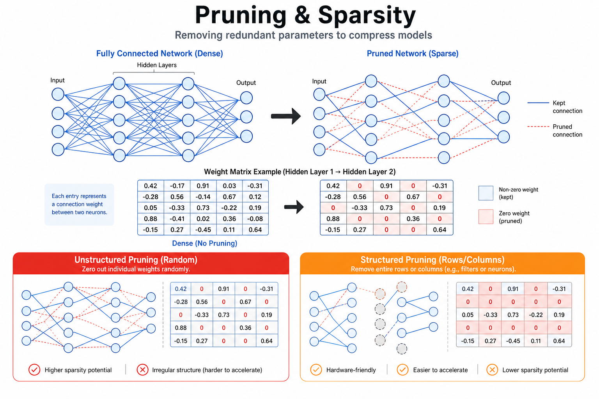
</p>

> Removing redundant parameters or inducing zeros in weights/activations to reduce model size and computation.

### 3.1 Survey Papers

| Year | Venue | Title | Links |
|------|-------|-------|-------|
| 2024 | arXiv | A Survey on Model Compression for Large Language Models | [[Paper](https://arxiv.org/abs/2308.07633)] |
| 2021 | arXiv | Sparsity in Deep Learning: Pruning and Growth for Efficient Inference and Training in Neural Networks | [[Paper](https://arxiv.org/abs/2102.00554)] |
| 2020 | arXiv | What is the State of Neural Network Pruning? | [[Paper](https://arxiv.org/abs/2003.03033)] [[Code](https://github.com/jjgo/shrinkbench)] |

### 3.2 Unstructured Pruning

| Year | Venue | Title | Links |
|------|-------|-------|-------|
| 2023 | ICML | SparseGPT: Massive Language Models Can Be Accurately Pruned in One-Shot | [[Paper](https://arxiv.org/abs/2301.00774)] [[Code](https://github.com/IST-DASLab/sparsegpt)] |
| 2023 | arXiv | Wanda: A Simple and Effective Pruning Approach for Large Language Models | [[Paper](https://arxiv.org/abs/2306.11695)] [[Code](https://github.com/locuslab/wanda)] |
| 2020 | ICLR | Comparing Rewinding and Fine-tuning in Neural Network Pruning | [[Paper](https://arxiv.org/abs/2003.02389)] [[Code](https://github.com/lottery-ticket/rewinding-iclr20-public)] |
| 2015 | NeurIPS | Learning Both Weights and Connections for Efficient Neural Networks | [[Paper](https://arxiv.org/abs/1506.02626)] |
| 1989 | NeurIPS | Optimal Brain Damage | [[Paper](http://yann.lecun.com/exdb/publis/pdf/lecun-90b.pdf)] |

### 3.3 Structured Pruning

| Year | Venue | Title | Links |
|------|-------|-------|-------|
| 2024 | arXiv | ShortGPT: Layers in Large Language Models Are More Redundant Than You Expect | [[Paper](https://arxiv.org/abs/2403.03853)] |
| 2024 | arXiv | LLM-Pruner: On the Structural Pruning of Large Language Models | [[Paper](https://arxiv.org/abs/2305.11627)] [[Code](https://github.com/horseee/LLM-Pruner)] |
| 2023 | NeurIPS | DepGraph: Towards Any Structural Pruning | [[Paper](https://arxiv.org/abs/2301.12900)] [[Code](https://github.com/VainF/Torch-Pruning)] |
| 2017 | ICLR | Pruning Filters for Efficient ConvNets | [[Paper](https://arxiv.org/abs/1608.08710)] |

### 3.4 Dynamic / Runtime Pruning

| Year | Venue | Title | Links |
|------|-------|-------|-------|
| 2024 | arXiv | PowerInfer: Fast Large Language Model Serving with a Consumer-grade GPU | [[Paper](https://arxiv.org/abs/2312.12456)] [[Code](https://github.com/SJTU-IPADS/PowerInfer)] |
| 2024 | arXiv | Deja Vu: Contextual Sparsity for Efficient LLMs at Inference Time | [[Paper](https://arxiv.org/abs/2310.17157)] |
| 2022 | ICML | SkipBERT: Efficient Inference with Shallow Layer Skipping | [[Paper](https://arxiv.org/abs/2211.09873)] |

### 3.5 LLM Pruning

| Year | Venue | Title | Links |
|------|-------|-------|-------|
| 2026 | ICLR | Optimal Brain Restoration for Joint Quantization and Sparsification of LLMs | [[Paper](https://openreview.net/forum?id=obr)] [[Code](https://github.com/)] |
| 2024 | arXiv | The Unreasonable Ineffectiveness of the Deeper Layers | [[Paper](https://arxiv.org/abs/2403.17887)] |
| 2023 | ICML | SparseGPT: Massive Language Models Can Be Accurately Pruned in One-Shot | [[Paper](https://arxiv.org/abs/2301.00774)] [[Code](https://github.com/IST-DASLab/sparsegpt)] |
| 2023 | arXiv | Wanda: A Simple and Effective Pruning Approach for Large Language Models | [[Paper](https://arxiv.org/abs/2306.11695)] [[Code](https://github.com/locuslab/wanda)] |

### 3.6 Lottery Ticket Hypothesis

| Year | Venue | Title | Links |
|------|-------|-------|-------|
| 2020 | ICML | Linear Mode Connectivity and the Lottery Ticket Hypothesis | [[Paper](https://arxiv.org/abs/1912.05671)] |
| 2020 | NeurIPS | Proving the Lottery Ticket Hypothesis: Pruning is All You Need | [[Paper](https://arxiv.org/abs/2002.00585)] |
| 2019 | ICLR | The Lottery Ticket Hypothesis: Finding Sparse, Trainable Neural Networks | [[Paper](https://arxiv.org/abs/1803.03635)] [[Code](https://github.com/google-research/lottery-ticket-hypothesis)] |
| 2020 | ICLR | Stabilizing the Lottery Ticket Hypothesis | [[Paper](https://arxiv.org/abs/1903.01611)] |

---

## 4. Knowledge Distillation

<p align="center">
  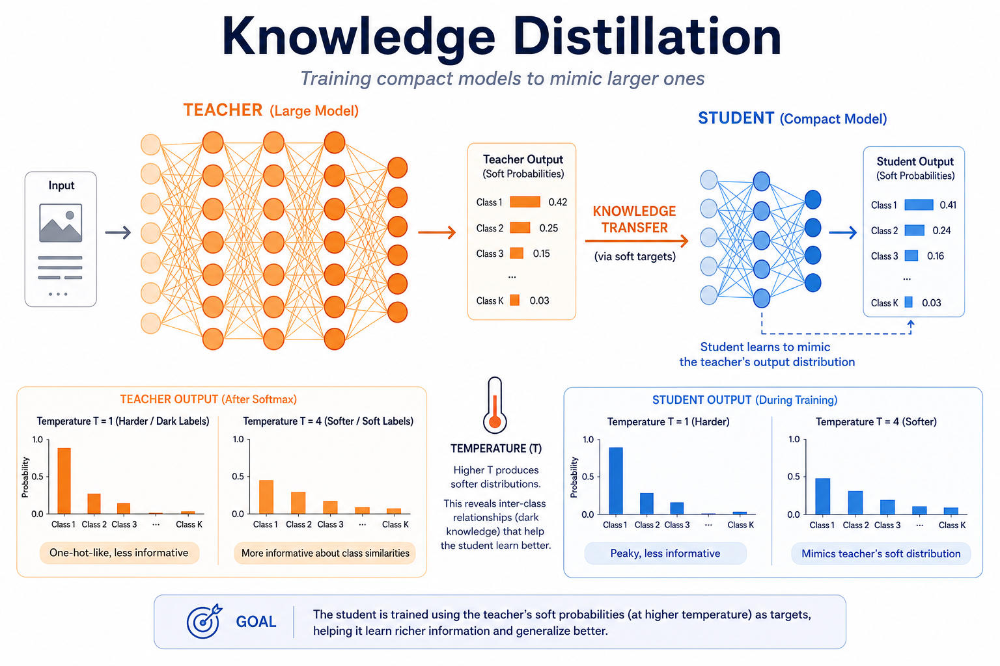
</p>

> Training a smaller "student" model to mimic a larger "teacher" model's behavior.

### 4.1 Survey Papers

| Year | Venue | Title | Links |
|------|-------|-------|-------|
| 2024 | arXiv | A Survey on Knowledge Distillation of Large Language Models | [[Paper](https://arxiv.org/abs/2402.13116)] |
| 2021 | IJCV | Knowledge Distillation: A Survey | [[Paper](https://arxiv.org/abs/2006.05525)] |

### 4.2 Response-Based Distillation

| Year | Venue | Title | Links |
|------|-------|-------|-------|
| 2015 | arXiv | Distilling the Knowledge in a Neural Network | [[Paper](https://arxiv.org/abs/1503.02531)] |
| 2020 | AAAI | Improved Knowledge Distillation via Teacher Assistant | [[Paper](https://arxiv.org/abs/1902.03393)] |

### 4.3 Feature-Based Distillation

| Year | Venue | Title | Links |
|------|-------|-------|-------|
| 2022 | CVPR | Knowledge Distillation with the Reused Teacher Classifier | [[Paper](https://arxiv.org/abs/2203.14001)] |
| 2019 | ICCV | A Comprehensive Overhaul of Feature Distillation | [[Paper](https://arxiv.org/abs/1904.01866)] [[Code](https://github.com/clovaai/overhaul-distillation)] |
| 2015 | ICLR | FitNets: Hints for Thin Deep Nets | [[Paper](https://arxiv.org/abs/1412.6550)] |

### 4.4 Self-Distillation

| Year | Venue | Title | Links |
|------|-------|-------|-------|
| 2021 | ICLR | Self-Distillation as Instance-Specific Label Smoothing | [[Paper](https://arxiv.org/abs/2006.05065)] |
| 2019 | AAAI | Born-Again Neural Networks (self-distillation) | [[Paper](https://arxiv.org/abs/1805.04770)] |

### 4.5 LLM Distillation

| Year | Venue | Title | Links |
|------|-------|-------|-------|
| 2025 | arXiv | Distilling Step-by-Step! Outperforming Larger Language Models with Less Training Data and Smaller Model Sizes | [[Paper](https://arxiv.org/abs/2305.02301)] |
| 2024 | arXiv | MiniLLM: Knowledge Distillation of Large Language Models | [[Paper](https://arxiv.org/abs/2306.08543)] [[Code](https://github.com/microsoft/LMOps)] |
| 2020 | EMNLP | TinyBERT: Distilling BERT for Natural Language Understanding | [[Paper](https://arxiv.org/abs/1909.10351)] [[Code](https://github.com/huawei-noah/Pretrained-Language-Model)] |
| 2019 | NeurIPS Workshop | DistilBERT, a distilled version of BERT: smaller, faster, cheaper and lighter | [[Paper](https://arxiv.org/abs/1910.01108)] [[Code](https://github.com/huggingface/transformers)] |

### 4.6 Data-Free Distillation

| Year | Venue | Title | Links |
|------|-------|-------|-------|
| 2023 | CVPR | Adaptive Data-Free Quantization | [[Paper](https://arxiv.org/abs/2303.01608)] |
| 2021 | CVPR | Diversifying Sample Generation for Accurate Data-Free Quantization | [[Paper](https://arxiv.org/abs/2103.01049)] |
| 2020 | ECCV | Generative Low-bitwidth Data Free Quantization | [[Paper](https://arxiv.org/abs/2003.03603)] [[Code](https://github.com/xushoukai/GDFQ)] |

---

## 5. Efficient Architectures

<p align="center">
  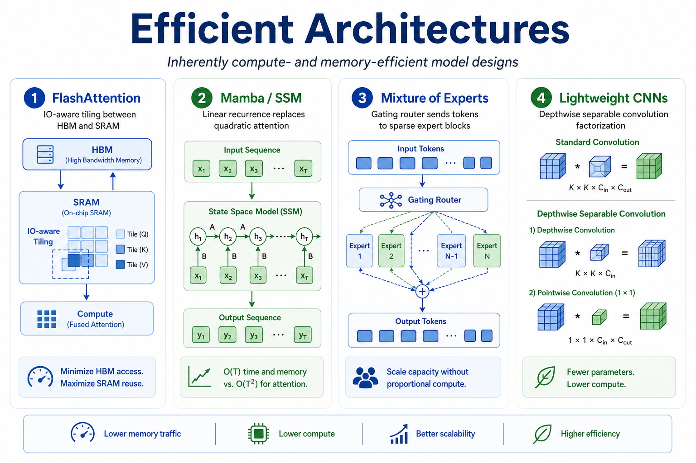
</p>

> Designing model architectures that are inherently more compute- and memory-efficient.

### 5.1 Efficient Transformers & Attention

| Year | Venue | Title | Links |
|------|-------|-------|-------|
| 2025 | ICML | SageAttention2: Efficient Attention with Thorough Outlier Smoothing and Per-thread INT4 Quantization | [[Paper](https://arxiv.org/abs/2411.10958)] [[Code](https://github.com/thu-ml/SageAttention)] |
| 2024 | arXiv | FlashAttention-3: Fast and Accurate Attention with Asynchrony and Low-precision | [[Paper](https://arxiv.org/abs/2407.08691)] |
| 2023 | NeurIPS | FlashAttention-2: Faster Attention with Better Parallelism and Work Partitioning | [[Paper](https://arxiv.org/abs/2307.08691)] [[Code](https://github.com/Dao-AILab/flash-attention)] |
| 2022 | NeurIPS | FlashAttention: Fast and Memory-Efficient Exact Attention with IO-Awareness | [[Paper](https://arxiv.org/abs/2205.14135)] [[Code](https://github.com/Dao-AILab/flash-attention)] |
| 2022 | arXiv | Efficient Transformers: A Survey | [[Paper](https://arxiv.org/abs/2009.06732)] |
| 2021 | ICML | Luna: Linear Unified Nested Attention | [[Paper](https://arxiv.org/abs/2106.01540)] |
| 2020 | ICLR | Reformer: The Efficient Transformer | [[Paper](https://arxiv.org/abs/2001.04451)] [[Code](https://github.com/google/trax)] |
| 2020 | arXiv | Linformer: Self-Attention with Linear Complexity | [[Paper](https://arxiv.org/abs/2006.04768)] |
| 2020 | ICML | Longformer: The Long-Document Transformer | [[Paper](https://arxiv.org/abs/2004.05150)] [[Code](https://github.com/allenai/longformer)] |

### 5.2 Linear Attention & State Space Models

| Year | Venue | Title | Links |
|------|-------|-------|-------|
| 2024 | ICML | Mamba-2: Structured State Spaces with Selective Attention | [[Paper](https://arxiv.org/abs/2405.21060)] [[Code](https://github.com/state-spaces/mamba)] |
| 2024 | ICLR | Mamba: Linear-Time Sequence Modeling with Selective State Spaces | [[Paper](https://arxiv.org/abs/2312.00752)] [[Code](https://github.com/state-spaces/mamba)] |
| 2024 | arXiv | RWKV: Reinventing RNNs for the Transformer Era | [[Paper](https://arxiv.org/abs/2305.13048)] [[Code](https://github.com/BlinkDL/RWKV-LM)] |
| 2023 | arXiv | RetNet: Retentive Network: A Successor to Transformer for Large Language Models | [[Paper](https://arxiv.org/abs/2307.08621)] |
| 2022 | ICLR | S4: Efficiently Modeling Long Sequences with Structured State Spaces | [[Paper](https://arxiv.org/abs/2111.00396)] [[Code](https://github.com/state-spaces/s4)] |
| 2021 | NeurIPS | FNet: Mixing Tokens with Fourier Transforms | [[Paper](https://arxiv.org/abs/2105.03824)] |

### 5.3 Mixture of Experts (MoE)

| Year | Venue | Title | Links |
|------|-------|-------|-------|
| 2026 | ICLR | CodeQuant: Unified Clustering and Quantization for Enhanced Outlier Smoothing in Low-Precision MoE | [[Paper](https://openreview.net/forum?id=codequant)] |
| 2025 | ICML | MxMoE: Mixed-precision Quantization for MoE with Accuracy and Performance Co-Design | [[Paper](https://arxiv.org/abs/2410.00000)] [[Code](https://github.com/)] |
| 2024 | arXiv | Mixtral of Experts | [[Paper](https://arxiv.org/abs/2401.04088)] |
| 2024 | arXiv | DeepSeek-MoE: Towards Ultimate Expert Specialization in MoE LLMs | [[Paper](https://arxiv.org/abs/2401.06066)] [[Code](https://github.com/deepseek-ai/DeepSeek-MoE)] |
| 2022 | ICML | ST-MoE: Designing Stable and Transferable Sparse Expert Models | [[Paper](https://arxiv.org/abs/2202.08906)] |
| 2022 | NeurIPS | Switch Transformers: Scaling to Trillion Parameter Models with Simple and Efficient Sparsity | [[Paper](https://arxiv.org/abs/2101.03961)] |

### 5.4 Lightweight CNNs

| Year | Venue | Title | Links |
|------|-------|-------|-------|
| 2024 | CVPR | RepViT: Revisiting Mobile CNN From ViT Perspective | [[Paper](https://arxiv.org/abs/2307.09283)] [[Code](https://github.com/THU-MIG/RepViT)] |
| 2022 | CVPR | EfficientNetV2: Smaller Models and Faster Training | [[Paper](https://arxiv.org/abs/2104.00298)] [[Code](https://github.com/google/automl)] |
| 2020 | CVPR | GhostNet: More Features from Cheap Operations | [[Paper](https://arxiv.org/abs/1911.11907)] [[Code](https://github.com/huawei-noah/ghostnet)] |
| 2019 | ICCV | Searching for MobileNetV3 | [[Paper](https://arxiv.org/abs/1905.02244)] |
| 2019 | CVPR | EfficientNet: Rethinking Model Scaling for Convolutional Neural Networks | [[Paper](https://arxiv.org/abs/1905.11946)] [[Code](https://github.com/tensorflow/tpu)] |
| 2018 | CVPR | ShuffleNet V2: Practical Guidelines for Efficient CNN Architecture Design | [[Paper](https://arxiv.org/abs/1807.11164)] |
| 2018 | CVPR | MobileNetV2: Inverted Residuals and Linear Bottlenecks | [[Paper](https://arxiv.org/abs/1801.04381)] |
| 2017 | arXiv | MobileNets: Efficient Convolutional Neural Networks for Mobile Vision Applications | [[Paper](https://arxiv.org/abs/1704.04861)] |

---

## 6. Neural Architecture Search (NAS)

<p align="center">
  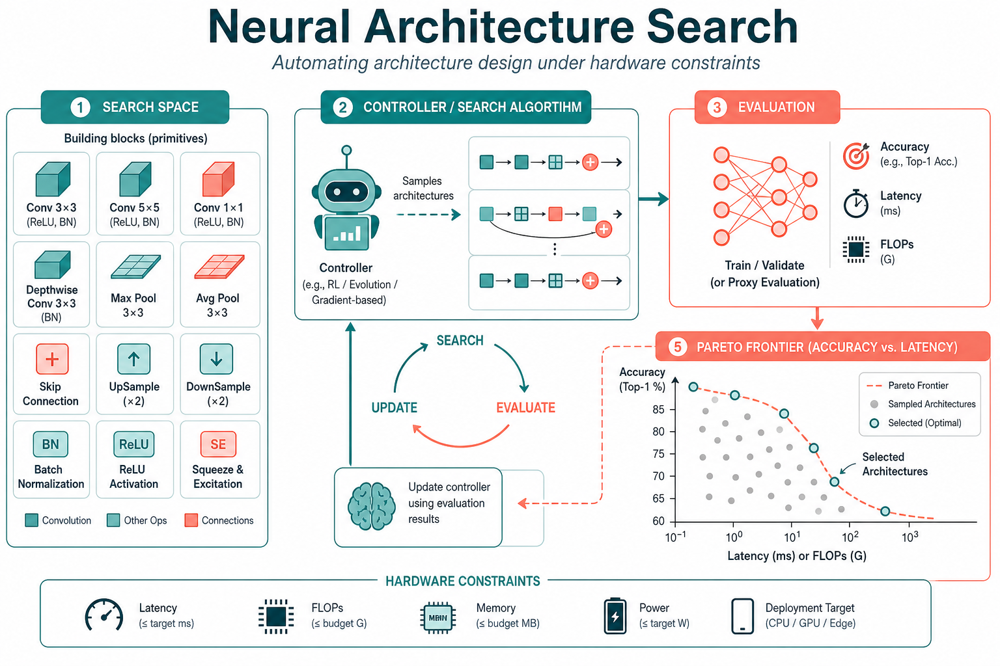
</p>

> Automating architecture design to find efficient models under hardware constraints.

### 6.1 Survey Papers

| Year | Venue | Title | Links |
|------|-------|-------|-------|
| 2020 | JMLR | Neural Architecture Search: A Survey | [[Paper](https://arxiv.org/abs/1808.05377)] |

### 6.2 Efficient NAS

| Year | Venue | Title | Links |
|------|-------|-------|-------|
| 2020 | ICLR | DARTS: Differentiable Architecture Search | [[Paper](https://arxiv.org/abs/1806.09055)] [[Code](https://github.com/quark0/darts)] |
| 2020 | ECCV | BigNAS: Scaling Up Neural Architecture Search with Big Single-Stage Models | [[Paper](https://arxiv.org/abs/2003.11142)] |
| 2019 | ICLR | ProxylessNAS: Direct Neural Architecture Search on Target Task and Hardware | [[Paper](https://arxiv.org/abs/1812.00332)] [[Code](https://github.com/mit-han-lab/proxylessnas)] |
| 2019 | ICML | ENAS: Efficient Neural Architecture Search via Parameter Sharing | [[Paper](https://arxiv.org/abs/1802.03268)] [[Code](https://github.com/melodyguan/enas)] |
| 2018 | CVPR | NASNet: Learning Transferable Architectures for Scalable Image Recognition | [[Paper](https://arxiv.org/abs/1707.07012)] |

### 6.3 Hardware-Aware NAS

| Year | Venue | Title | Links |
|------|-------|-------|-------|
| 2022 | ICLR | OFA: Once-for-All: Train One Network and Specialize it for Efficient Deployment | [[Paper](https://arxiv.org/abs/1908.09791)] [[Code](https://github.com/mit-han-lab/once-for-all)] |
| 2020 | CVPR | FBNetV2: Differentiable Neural Architecture Search for Spatial and Channel Dimensions | [[Paper](https://arxiv.org/abs/2004.05565)] |
| 2019 | CVPR | FBNet: Hardware-Aware Efficient ConvNet Design via Differentiable NAS | [[Paper](https://arxiv.org/abs/1812.03443)] |
| 2019 | CVPR | MnasNet: Platform-Aware Neural Architecture Search for Mobile | [[Paper](https://arxiv.org/abs/1807.11626)] [[Code](https://github.com/tensorflow/tpu)] |

---

## 7. Training Optimization

<p align="center">
  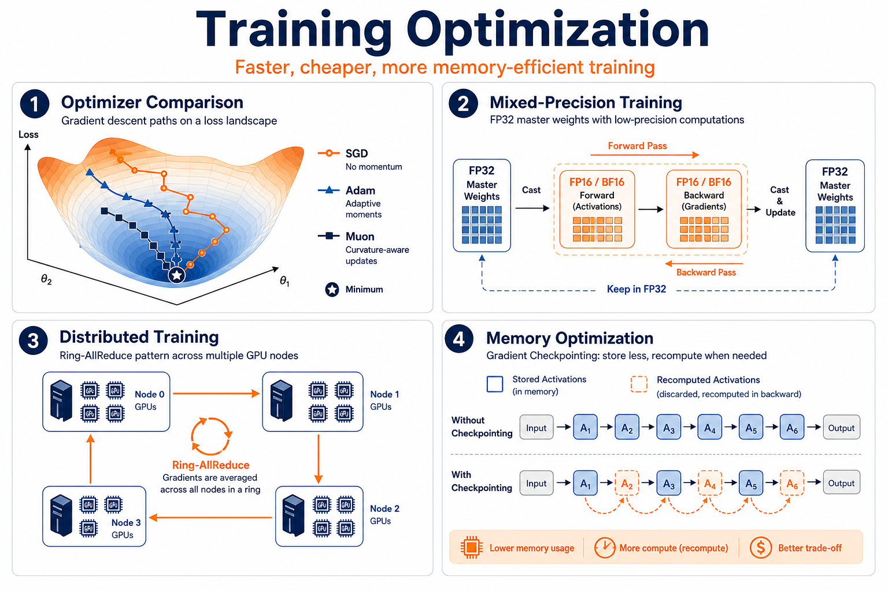
</p>

> Making the training process itself faster, cheaper, and more memory-efficient.

### 7.1 Optimizers

| Year | Venue | Title | Links |
|------|-------|-------|-------|
| 2025 | arXiv | Muon: An Optimizer for Hidden Layers in Neural Networks | [[Paper](https://arxiv.org/abs/2502.16982)] [[Code](https://github.com/KellerJordan/Muon)] |
| 2024 | arXiv | SOAP: Improving and Stabilizing Shampoo using Adam | [[Paper](https://arxiv.org/abs/2409.11321)] [[Code](https://github.com/nikhilvyas/SOAP)] |
| 2024 | arXiv | Grokfast: Accelerated Grokking by Amplifying Slow Gradients | [[Paper](https://arxiv.org/abs/2405.20233)] [[Code](https://github.com/ironjr/grokfast)] |
| 2023 | arXiv | Sophia: A Scalable Stochastic Second-order Optimizer for Language Model Pre-training | [[Paper](https://arxiv.org/abs/2305.14342)] [[Code](https://github.com/Liuhong99/Sophia)] |
| 2020 | ICLR | LAMB: Large Batch Optimization for Deep Learning: Training BERT in 76 Minutes | [[Paper](https://arxiv.org/abs/1904.00962)] |
| 2019 | ICLR | AdamW: Decoupled Weight Decay Regularization | [[Paper](https://arxiv.org/abs/1711.05101)] |
| 2018 | arXiv | Shampoo: Preconditioned Stochastic Tensor Optimization | [[Paper](https://arxiv.org/abs/1802.09568)] |
| 2015 | ICLR | Adam: A Method for Stochastic Optimization | [[Paper](https://arxiv.org/abs/1412.6980)] |

### 7.2 Mixed-Precision Training

| Year | Venue | Title | Links |
|------|-------|-------|-------|
| 2026 | ICLR | Bridging the Gap Between Promise and Performance for FP4 Quantization | [[Paper](https://openreview.net/forum?id=fp4)] [[Code](https://github.com/)] |
| 2025 | ICML | Optimizing Large Language Model Training Using FP4 Quantization | [[Paper](https://arxiv.org/abs/2501.00000)] |
| 2022 | NeurIPS | FP8 Quantization: The Power of the Exponent | [[Paper](https://arxiv.org/abs/2208.09225)] [[Code](https://github.com/Qualcomm-AI-research/FP8-quantization)] |
| 2018 | ICLR | Mixed Precision Training | [[Paper](https://arxiv.org/abs/1710.03740)] |

### 7.3 Gradient Compression & Communication

| Year | Venue | Title | Links |
|------|-------|-------|-------|
| 2024 | NeurIPS | SDP4Bit: Toward 4-bit Communication Quantization in Sharded Data Parallelism for LLM Training | [[Paper](https://arxiv.org/abs/2410.00000)] [[Code](https://github.com/)] |
| 2022 | ICLR | 8-bit Optimizers via Block-wise Quantization | [[Paper](https://arxiv.org/abs/2110.02861)] [[Code](https://github.com/TimDettmers/bitsandbytes)] |
| 2020 | NeurIPS | Adaptive Gradient Quantization for Data-Parallel SGD | [[Paper](https://arxiv.org/abs/2010.12460)] [[Code](https://github.com/tabrizian/learning-to-quantize)] |
| 2018 | ICLR | Deep Gradient Compression: Reducing the Communication Bandwidth for Distributed Training | [[Paper](https://arxiv.org/abs/1712.01887)] |
| 2017 | NeurIPS | QSGD: Communication-Efficient SGD via Gradient Quantization and Encoding | [[Paper](https://arxiv.org/abs/1610.02132)] |

### 7.4 Large-Scale Distributed Training

| Year | Venue | Title | Links |
|------|-------|-------|-------|
| 2024 | arXiv | Ring Attention with Blockwise Transformers for Near-Infinite Context | [[Paper](https://arxiv.org/abs/2310.01889)] |
| 2023 | ICML | FlexGen: High-Throughput Generative Inference of Large Language Models with a Single GPU | [[Paper](https://arxiv.org/abs/2303.06865)] [[Code](https://github.com/FMInference/FlexGen)] |
| 2020 | arXiv | ZeRO: Memory Optimizations Toward Training Trillion Parameter Models | [[Paper](https://arxiv.org/abs/1910.02054)] |
| 2019 | KDD | Megatron-LM: Training Multi-Billion Parameter Language Models Using Model Parallelism | [[Paper](https://arxiv.org/abs/1909.08053)] [[Code](https://github.com/NVIDIA/Megatron-LM)] |
| 2019 | arXiv | GPipe: Efficient Training of Giant Neural Networks using Pipeline Parallelism | [[Paper](https://arxiv.org/abs/1811.06965)] |

### 7.5 Memory-Efficient Training

| Year | Venue | Title | Links |
|------|-------|-------|-------|
| 2024 | arXiv | GaLore: Memory-Efficient LLM Training by Gradient Low-Rank Projection | [[Paper](https://arxiv.org/abs/2403.03507)] [[Code](https://github.com/jiaweizzhao/GaLore)] |
| 2023 | NeurIPS | Memory-Efficient Fine-Tuning of Compressed Large Language Models via sub-4-bit Integer Quantization | [[Paper](https://arxiv.org/abs/2305.14152)] |
| 2021 | ICML | ActNN: Reducing Training Memory Footprint via 2-Bit Activation Compressed Training | [[Paper](https://arxiv.org/abs/2104.14129)] [[Code](https://github.com/ucbrise/actnn)] |
| 2016 | arXiv | Training Deep Nets with Sublinear Memory Cost (Gradient Checkpointing) | [[Paper](https://arxiv.org/abs/1604.06174)] |

---

## 8. Inference Optimization

<p align="center">
  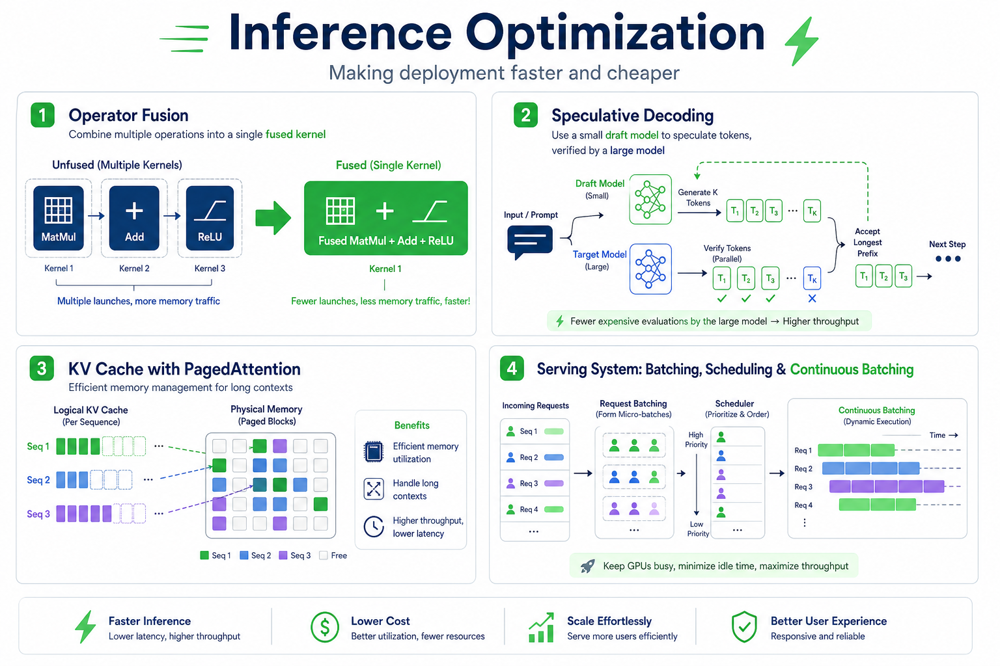
</p>

> Making model inference faster and cheaper during deployment.

### 8.1 Operator Fusion & Kernel Optimization

| Year | Venue | Title | Links |
|------|-------|-------|-------|
| 2025 | arXiv | FlashInfer: Efficient and Customizable Attention Engine for LLM Inference Serving | [[Paper](https://arxiv.org/abs/2501.01005)] [[Code](https://github.com/flashinfer-ai/flashinfer)] |
| 2024 | arXiv | Triton: An Intermediate Language and Compiler for Tiled Neural Network Computations | [[Paper](https://www.eecs.harvard.edu/~htk/publication/2019-mapl-tillet-kung-cox.pdf)] [[Code](https://github.com/triton-lang/triton)] |
| 2023 | MLSys | TensorRT-LLM: High-Performance Inference for Large Language Models | [[Code](https://github.com/NVIDIA/TensorRT-LLM)] |
| 2018 | OSDI | TVM: An Automated End-to-End Optimizing Compiler for Deep Learning | [[Paper](https://arxiv.org/abs/1802.04799)] [[Code](https://github.com/apache/tvm)] |

### 8.2 Speculative Decoding

| Year | Venue | Title | Links |
|------|-------|-------|-------|
| 2025 | arXiv | Eagle-2: Faster Inference of Language Models with Dynamic Draft Trees | [[Paper](https://arxiv.org/abs/2406.16858)] [[Code](https://github.com/SafeAILab/EAGLE)] |
| 2024 | ICML | EAGLE: Speculative Sampling Requires Rethinking Feature Uncertainty | [[Paper](https://arxiv.org/abs/2401.15077)] [[Code](https://github.com/SafeAILab/EAGLE)] |
| 2024 | ICML | Medusa: Simple LLM Inference Acceleration Framework with Multiple Decoding Heads | [[Paper](https://arxiv.org/abs/2401.10774)] [[Code](https://github.com/FasterDecoding/Medusa)] |
| 2023 | ICML | Fast Inference from Transformers via Speculative Decoding | [[Paper](https://arxiv.org/abs/2211.17192)] |
| 2023 | NeurIPS | SpecInfer: Accelerating Generative Large Language Model Serving with Tree-based Speculative Inference | [[Paper](https://arxiv.org/abs/2305.09781)] |

### 8.3 KV Cache Optimization

| Year | Venue | Title | Links |
|------|-------|-------|-------|
| 2024 | arXiv | MLA: Multi-Head Latent Attention (DeepSeek-V2) | [[Paper](https://arxiv.org/abs/2405.04434)] |
| 2024 | arXiv | CLA: Cross-Layer Attention for Efficient KV Cache | [[Paper](https://arxiv.org/abs/2405.12981)] |
| 2024 | arXiv | SnapKV: LLM Knows What You are Looking for Before Generation | [[Paper](https://arxiv.org/abs/2404.14469)] [[Code](https://github.com/FasterDecoding/SnapKV)] |
| 2024 | arXiv | PyramidKV: Dynamic KV Cache Compression based on Pyramidal Information Funneling | [[Paper](https://arxiv.org/abs/2406.02069)] |
| 2024 | ICLR | GQA: Training Generalized Multi-Query Transformer Models from Multi-Head Checkpoints | [[Paper](https://arxiv.org/abs/2305.13245)] |
| 2023 | EMNLP | Efficient Streaming Language Models with Attention Sinks | [[Paper](https://arxiv.org/abs/2309.17453)] [[Code](https://github.com/mit-han-lab/streaming-llm)] |
| 2019 | arXiv | Multi-Query Attention (MQA): Fast Transformer Decoding | [[Paper](https://arxiv.org/abs/1911.02150)] |

### 8.4 Batching & Scheduling

| Year | Venue | Title | Links |
|------|-------|-------|-------|
| 2024 | SOSP | SGLang: Efficient Execution of Structured Language Model Programs | [[Paper](https://arxiv.org/abs/2312.07104)] [[Code](https://github.com/sgl-project/sglang)] |
| 2024 | SOSP | vLLM: Efficient Memory Management for Large Language Model Serving with PagedAttention | [[Paper](https://arxiv.org/abs/2309.06180)] [[Code](https://github.com/vllm-project/vllm)] |
| 2023 | OSDI | Orca: A Distributed Serving System for Transformer-Based Generative Models | [[Paper](https://www.usenix.org/conference/osdi22/presentation/yu)] |

### 8.5 Compilation & Graph Optimization

| Year | Venue | Title | Links |
|------|-------|-------|-------|
| 2024 | arXiv | torch.compile: PyTorch 2.x Compiler | [[Code](https://github.com/pytorch/pytorch)] |
| 2023 | arXiv | MLIR: A Compiler Infrastructure for the End of Moore's Law | [[Paper](https://arxiv.org/abs/2002.11054)] |
| 2021 | arXiv | XLA: Optimizing Compiler for Machine Learning | [[Code](https://github.com/openxla/xla)] |
| 2018 | OSDI | TVM: An Automated End-to-End Optimizing Compiler for Deep Learning | [[Paper](https://arxiv.org/abs/1802.04799)] [[Code](https://github.com/apache/tvm)] |

---

## 9. Efficient Fine-Tuning (PEFT)

<p align="center">
  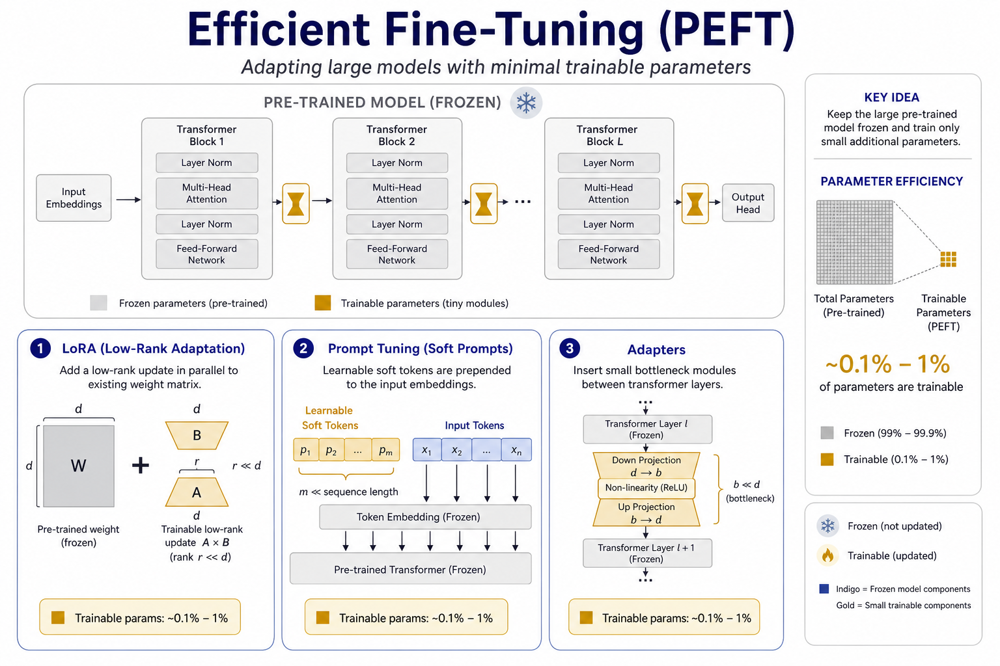
</p>

> Adapting large pre-trained models with minimal trainable parameters.

### 9.1 LoRA & Variants

| Year | Venue | Title | Links |
|------|-------|-------|-------|
| 2025 | arXiv | DoRA: Weight-Decomposed Low-Rank Adaptation | [[Paper](https://arxiv.org/abs/2402.09353)] [[Code](https://github.com/NVlabs/DoRA)] |
| 2024 | arXiv | LoRA+: Efficient Low Rank Adaptation of Large Models | [[Paper](https://arxiv.org/abs/2402.12354)] [[Code](https://github.com/nikhil-ghosh-berkeley/loraplus)] |
| 2024 | ICLR | LoftQ: LoRA-Fine-Tuning-aware Quantization for Large Language Models | [[Paper](https://arxiv.org/abs/2310.08659)] [[Code](https://github.com/yxli2123/LoftQ)] |
| 2024 | ICLR | QA-LoRA: Quantization-Aware Low-Rank Adaptation of Large Language Models | [[Paper](https://arxiv.org/abs/2309.14717)] [[Code](https://github.com/yuanzhoulvpi2017/zero_nlp)] |
| 2023 | NeurIPS | QLoRA: Efficient Finetuning of Quantized LLMs | [[Paper](https://arxiv.org/abs/2305.14314)] [[Code](https://github.com/artidoro/qlora)] |
| 2022 | ICLR | LoRA: Low-Rank Adaptation of Large Language Models | [[Paper](https://arxiv.org/abs/2106.09685)] [[Code](https://github.com/microsoft/LoRA)] |

### 9.2 Prompt Tuning & Adapters

| Year | Venue | Title | Links |
|------|-------|-------|-------|
| 2023 | ICLR | LLaMA-Adapter: Efficient Fine-tuning of Language Models with Zero-init Attention | [[Paper](https://arxiv.org/abs/2303.16199)] [[Code](https://github.com/OpenGVLab/LLaMA-Adapter)] |
| 2022 | ACL | P-Tuning v2: Prompt Tuning Can Be Comparable to Fine-tuning Across Scales and Tasks | [[Paper](https://arxiv.org/abs/2110.07602)] [[Code](https://github.com/THUDM/P-tuning-v2)] |
| 2021 | EMNLP | The Power of Scale for Parameter-Efficient Prompt Tuning | [[Paper](https://arxiv.org/abs/2104.08691)] |
| 2021 | arXiv | Prefix-Tuning: Optimizing Continuous Prompts for Generation | [[Paper](https://arxiv.org/abs/2101.00190)] [[Code](https://github.com/XiangLi1999/PrefixTuning)] |
| 2019 | ICML | Parameter-Efficient Transfer Learning for NLP (Adapters) | [[Paper](https://arxiv.org/abs/1902.00751)] |

---

## 10. Token & Sequence Optimization

<p align="center">
  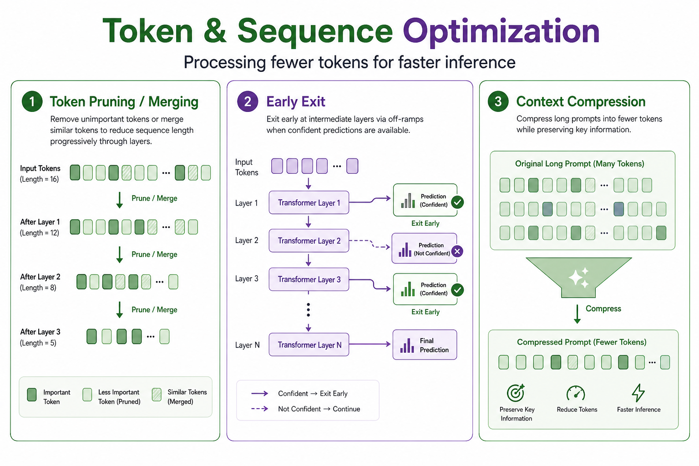
</p>

> Reducing compute by processing fewer tokens or exiting early.

### 10.1 Token Pruning & Merging

| Year | Venue | Title | Links |
|------|-------|-------|-------|
| 2024 | arXiv | FastV: An Image is Worth 1/2 Tokens After Layer 2 (vision-language token pruning) | [[Paper](https://arxiv.org/abs/2403.06764)] [[Code](https://github.com/pkunlp-icler/FastV)] |
| 2023 | ICLR | Token Merging: Your ViT But Faster (ToMe) | [[Paper](https://arxiv.org/abs/2210.09461)] [[Code](https://github.com/facebookresearch/ToMe)] |
| 2022 | NeurIPS | Token Merging for Fast Stable Diffusion | [[Paper](https://arxiv.org/abs/2303.17604)] [[Code](https://github.com/dbolya/tomesd)] |
| 2022 | ECCV | DynamicViT: Efficient Vision Transformers with Dynamic Token Sparsification | [[Paper](https://arxiv.org/abs/2106.02034)] [[Code](https://github.com/raoyongming/DynamicViT)] |

### 10.2 Early Exit / Dynamic Inference

| Year | Venue | Title | Links |
|------|-------|-------|-------|
| 2024 | arXiv | CALM: Confident Adaptive Language Modeling | [[Paper](https://arxiv.org/abs/2207.07061)] |
| 2020 | ACL | DeeBERT: Dynamic Early Exiting for Accelerating BERT Inference | [[Paper](https://arxiv.org/abs/2004.12993)] [[Code](https://github.com/castorini/DeeBERT)] |
| 2017 | ICML | Adaptive Computation Time for Recurrent Neural Networks | [[Paper](https://arxiv.org/abs/1603.08983)] |

### 10.3 Context Compression

| Year | Venue | Title | Links |
|------|-------|-------|-------|
| 2024 | arXiv | LLMLingua-2: Data Distillation for Efficient and Faithful Task-Agnostic Prompt Compression | [[Paper](https://arxiv.org/abs/2403.12968)] [[Code](https://github.com/microsoft/LLMLingua)] |
| 2023 | EMNLP | LLMLingua: Compressing Prompts for Accelerated Inference of Large Language Models | [[Paper](https://arxiv.org/abs/2310.05736)] [[Code](https://github.com/microsoft/LLMLingua)] |

---

## 11. Hardware-Specific Optimization

<p align="center">
  
</p>

> Optimizations tailored to specific hardware platforms.

### 11.1 GPU Kernel Engineering

| Year | Venue | Title | Links |
|------|-------|-------|-------|
| 2024 | GitHub | fast-hadamard-transform (Tri Dao fused CUDA kernel for FHT) | [[Code](https://github.com/Dao-AILab/fast-hadamard-transform)] |
| 2024 | arXiv | ThunderKittens: Simple, Fast, and Adorable AI Kernels | [[Paper](https://arxiv.org/abs/2410.00000)] [[Code](https://github.com/HazyResearch/ThunderKittens)] |
| 2024 | arXiv | cutlass: CUDA Templates for Linear Algebra Subroutines | [[Code](https://github.com/NVIDIA/cutlass)] |
| 2023 | NeurIPS | FlashAttention-2 | [[Paper](https://arxiv.org/abs/2307.08691)] [[Code](https://github.com/Dao-AILab/flash-attention)] |

### 11.2 Edge & Mobile Deployment

| Year | Venue | Title | Links |
|------|-------|-------|-------|
| 2024 | arXiv | MLC LLM: Universal LLM Deployment Engine for Mobile and Edge | [[Code](https://github.com/mlc-ai/mlc-llm)] |
| 2024 | arXiv | llama.cpp: Inference of LLaMA model in pure C/C++ | [[Code](https://github.com/ggerganov/llama.cpp)] |
| 2022 | MLSys | On-Device Training Under 256KB Memory | [[Paper](https://arxiv.org/abs/2206.15472)] |
| 2021 | NeurIPS | MCUNet: Tiny Deep Learning on IoT Devices | [[Paper](https://arxiv.org/abs/2007.10319)] [[Code](https://github.com/mit-han-lab/mcunet)] |
| 2017 | arXiv | TensorFlow Lite: On-device Machine Learning | [[Code](https://github.com/tensorflow/tensorflow)] |

### 11.3 FPGA & ASIC Accelerators

| Year | Venue | Title | Links |
|------|-------|-------|-------|
| 2023 | ISSCC | Accelerator Architectures for AI/ML | [[Paper](https://www.isscc.org/)] |
| 2017 | ISCA | In-Datacenter Performance Analysis of a Tensor Processing Unit (Google TPU) | [[Paper](https://arxiv.org/abs/1704.04760)] |
| 2017 | FPGA | FINN: A Framework for Fast, Scalable Binarized Neural Network Inference | [[Paper](https://arxiv.org/abs/1612.07119)] [[Code](https://github.com/Xilinx/finn)] |

---

## 12. Activation & Normalization Optimization

<p align="center">
  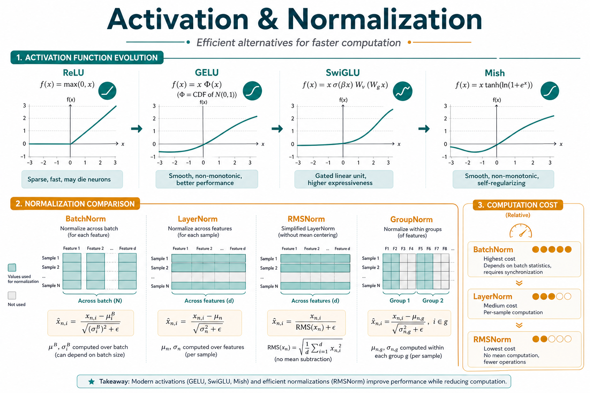
</p>

> Efficient alternatives to standard normalization and activation functions.

| Year | Venue | Title | Links |
|------|-------|-------|-------|
| 2024 | arXiv | nGPT: Normalized Transformer with Representation Learning on the Hypersphere | [[Paper](https://arxiv.org/abs/2410.01131)] |
| 2023 | arXiv | RMSNorm: Root Mean Square Layer Normalization | [[Paper](https://arxiv.org/abs/1910.07467)] |
| 2020 | NeurIPS | GLU Variants Improve Transformer (SwiGLU, GeGLU) | [[Paper](https://arxiv.org/abs/2002.05202)] |
| 2019 | arXiv | Mish: A Self Regularized Non-Monotonic Activation Function | [[Paper](https://arxiv.org/abs/1908.08681)] [[Code](https://github.com/digantamisra98/Mish)] |
| 2016 | arXiv | Group Normalization | [[Paper](https://arxiv.org/abs/1803.08494)] |
| 2015 | ICML | Batch Normalization: Accelerating Deep Network Training by Reducing Internal Covariate Shift | [[Paper](https://arxiv.org/abs/1502.03167)] |

---

## 13. Data Efficiency & Augmentation

<p align="center">
  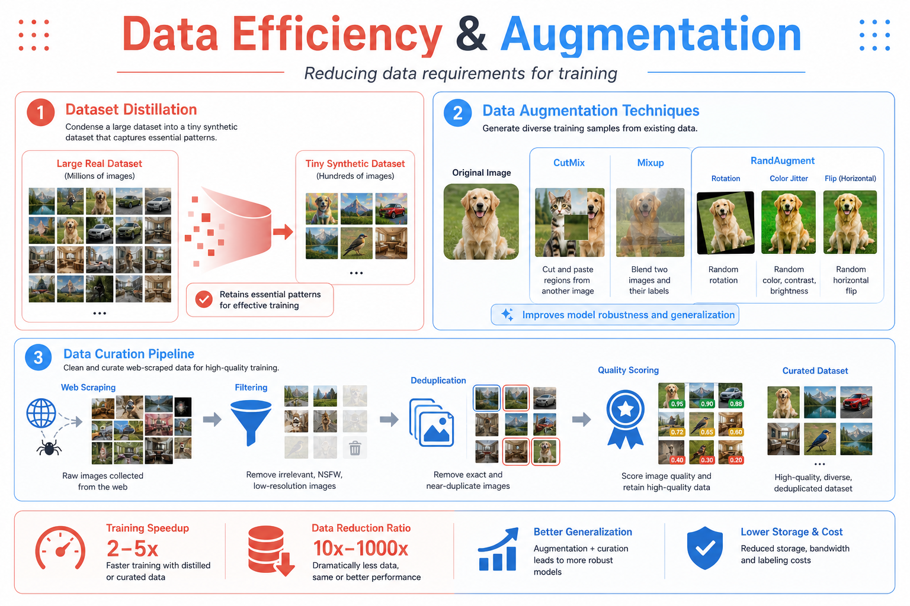
</p>

> Reducing the amount of data or compute needed during training.

| Year | Venue | Title | Links |
|------|-------|-------|-------|
| 2023 | ICML | DataComp: In Search of the Next Generation of Multimodal Datasets | [[Paper](https://arxiv.org/abs/2304.14108)] [[Code](https://github.com/mlfoundations/datacomp)] |
| 2022 | ICML | Dataset Distillation by Matching Training Trajectories | [[Paper](https://arxiv.org/abs/2203.11932)] [[Code](https://github.com/GeorgeCazenavette/mtt-distillation)] |
| 2021 | arXiv | Dataset Distillation: A Comprehensive Review | [[Paper](https://arxiv.org/abs/2301.07014)] |
| 2020 | NeurIPS | Dataset Condensation with Gradient Matching | [[Paper](https://arxiv.org/abs/2006.05929)] [[Code](https://github.com/VICO-UoE/DatasetCondensation)] |
| 2019 | ICLR | RandAugment: Practical Automated Data Augmentation with a Reduced Search Space | [[Paper](https://arxiv.org/abs/1909.13719)] |
| 2018 | ICML | CutMix: Regularization Strategy to Train Strong Classifiers with Localizable Features | [[Paper](https://arxiv.org/abs/1905.04899)] [[Code](https://github.com/clovaai/CutMix-PyTorch)] |
| 2018 | ICLR | Mixup: Beyond Empirical Risk Minimization | [[Paper](https://arxiv.org/abs/1710.09412)] |

---

## Related Awesome Lists

| Repository | Focus |
|------------|-------|
| [Awesome-Model-Quantization](https://github.com/Efficient-ML/Awesome-Model-Quantization) | Comprehensive quantization papers |
| [Awesome-Pruning](https://github.com/he-y/Awesome-Pruning) | Neural network pruning |
| [Awesome-Knowledge-Distillation](https://github.com/dkozlov/awesome-knowledge-distillation) | Knowledge distillation |
| [Awesome-Efficient-LLM](https://github.com/horseee/Awesome-Efficient-LLM) | LLM efficiency |
| [Awesome-LLM-Compression](https://github.com/HuangOwen/Awesome-LLM-Compression) | LLM compression |
| [Efficient-Multimodal-LLMs-Survey](https://github.com/lijiannuist/Efficient-Multimodal-LLMs-Survey) | Efficient multimodal LLMs |
| [Awesome-NAS](https://github.com/D-X-Y/Awesome-NAS) | Neural architecture search |
| [Awesome-Flash-Attention](https://github.com/sIncerass/Awesome-Flash-Attention) | Flash attention variants |
| [Awesome-PEFT](https://github.com/huggingface/peft) | Parameter-efficient fine-tuning |

---

## Frameworks & Tools

| Tool | Description | Links |
|------|-------------|-------|
| **bitsandbytes** | 8-bit optimizers and quantization for PyTorch | [[Code](https://github.com/TimDettmers/bitsandbytes)] |
| **AutoGPTQ** | Easy-to-use GPTQ quantization | [[Code](https://github.com/AutoGPTQ/AutoGPTQ)] |
| **llama.cpp (GGUF)** | CPU/GPU inference with quantized models | [[Code](https://github.com/ggerganov/llama.cpp)] |
| **vLLM** | High-throughput LLM serving with PagedAttention | [[Code](https://github.com/vllm-project/vllm)] |
| **SGLang** | Structured generation language for LLMs | [[Code](https://github.com/sgl-project/sglang)] |
| **TensorRT-LLM** | NVIDIA high-performance LLM inference | [[Code](https://github.com/NVIDIA/TensorRT-LLM)] |
| **ONNX Runtime** | Cross-platform inference acceleration | [[Code](https://github.com/microsoft/onnxruntime)] |
| **OpenVINO** | Intel inference optimization toolkit | [[Code](https://github.com/openvinotoolkit/openvino)] |
| **Apache TVM** | End-to-end deep learning compiler | [[Code](https://github.com/apache/tvm)] |
| **MLC LLM** | Universal LLM deployment on any device | [[Code](https://github.com/mlc-ai/mlc-llm)] |
| **Triton** | Language and compiler for GPU kernels | [[Code](https://github.com/triton-lang/triton)] |
| **FlashAttention** | Fast and memory-efficient exact attention | [[Code](https://github.com/Dao-AILab/flash-attention)] |
| **fast-hadamard-transform** | Fused CUDA kernel for Hadamard transform (Tri Dao) | [[Code](https://github.com/Dao-AILab/fast-hadamard-transform)] |
| **Fast-Hadamard-Transform** | Comprehensive FHT benchmark with 6 use cases | [[Code](https://github.com/Gaurav14cs17/Fast-Hadamard-Transform)] |
| **DeepSpeed** | Microsoft distributed training & inference library | [[Code](https://github.com/microsoft/DeepSpeed)] |
| **FSDP / PyTorch** | Fully Sharded Data Parallelism | [[Code](https://github.com/pytorch/pytorch)] |
| **Torch-Pruning** | Structural pruning framework | [[Code](https://github.com/VainF/Torch-Pruning)] |
| **PEFT (HuggingFace)** | Parameter-efficient fine-tuning library | [[Code](https://github.com/huggingface/peft)] |
| **LLMC** | LLM compression toolkit | [[Code](https://github.com/ModelTC/llmc)] |

---

## Optimization Taxonomy at a Glance

<p align="center">
  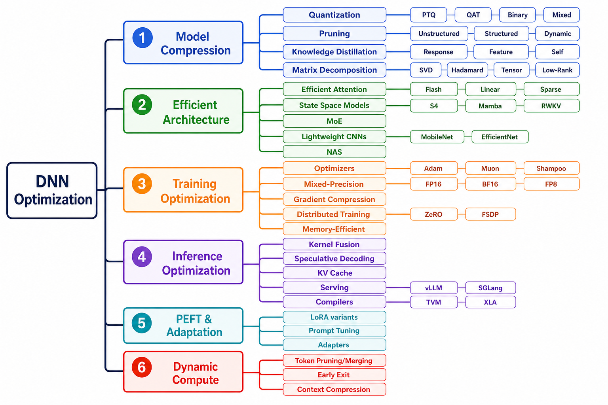
</p>

---

## Contributing

We welcome contributions! To add a paper or tool:

1. Fork this repository
2. Add your entry in the appropriate section following the existing format
3. Submit a pull request

Please ensure entries include: **Year, Venue, Title, Paper link, and Code link (if available)**.

---

## Citation

If you find this repository useful, please consider citing:

```bibtex
@misc{awesome-dnn-optimization,
  title={Awesome Deep Neural Network Optimization},
  author={Gaurav Goswami},
  year={2026},
  howpublished={\url{https://github.com/Gaurav14cs17/Awesome-DNN-Optimization}},
}
```

---

## Star History

If you find this project helpful, please give it a ⭐!

---

## License

This project is licensed under the MIT License.
